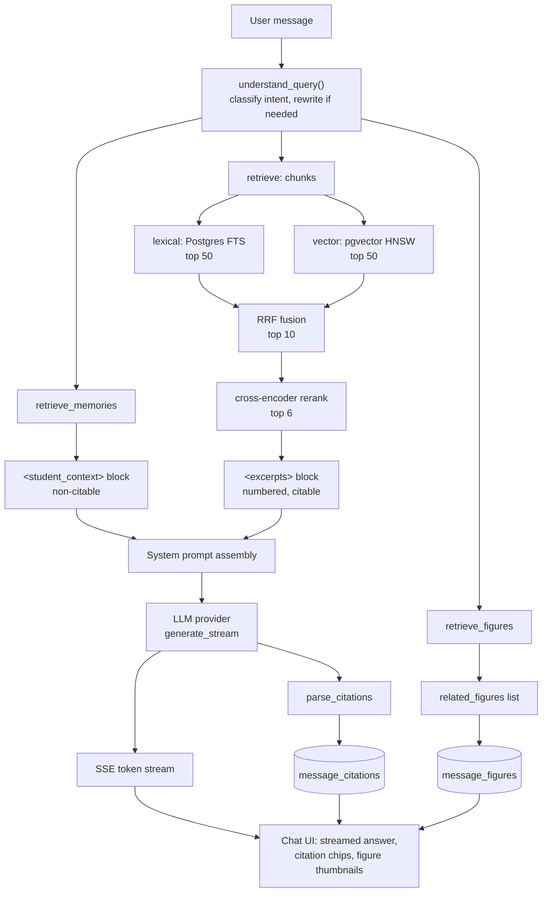

# Multi-Turn Hybrid Retrieval System with Agentic Memory

<video src="https://github.com/user-attachments/assets/ec8fe744-5214-47cf-bb63-e9b0d99d01c7" controls width = "700"></video>

A personal, local-first RAG system for studying from your own course notes.
Upload PDFs, Word docs, and PowerPoint slides, organized into courses; ask
questions in a multi-turn chat that resolves follow-ups and topic switches,
answers **using only your notes** via hybrid (lexical + embedding + rerank)
retrieval, remembers durable facts about you across sessions, and can
surface a relevant diagram or figure alongside a cited text answer. Every
claim cites which excerpt it came from; click a citation (or a figure
thumbnail) to open a side panel showing the actual source page.

This started as a single-phase hybrid-RAG build and was extended across 4
further phases (query understanding, semantic memory, an evaluation
harness, multimodal retrieval) per [`RETRIEVAL_UPGRADE_PLAN.md`](RETRIEVAL_UPGRADE_PLAN.md).
See [Results](#results), [Design decisions](#design-decisions), and
[What this is not](#what-this-is-not-honest-limitations) below for what's
actually been measured and what hasn't.

## What it does

- **Organize by course.** Every uploaded document belongs to exactly one
  course; chat is scoped to one course at a time.
- **Upload PDF / DOCX / PPTX.** Non-PDF files are converted to PDF at ingest
  time (headless LibreOffice), so there's a single rendering path for every
  format.
- **Ask questions, get grounded answers.** The assistant answers strictly from
  the retrieved excerpts. If the notes don't cover a question, it says so
  instead of falling back to outside knowledge.
- **Resolves follow-ups across turns.** "What about the second one?" gets
  classified and, if needed, rewritten to a standalone query before
  retrieval runs — not just pattern-matched.
- **Remembers you across sessions.** Durable facts (topics you've struggled
  with, preferences, goals) are extracted opportunistically at end-of-session
  and surfaced in later sessions, non-citable and separate from the answer's
  sourced content.
- **Finds relevant figures, not just text.** Diagrams, charts, and
  screenshots extracted from your slides are searchable by natural-language
  query via image embeddings, surfaced alongside — never instead of — the
  cited text answer.
- **Inline citations.** Every factual claim is tagged `[n]`, rendered as a
  clickable chip.
- **Click a citation → see the source.** A slide-out panel opens the actual
  PDF page the claim (or figure) came from (rendered with `pdf.js`), without
  leaving the chat.
- **Single-user, no auth.** This is a local tool for one person — no login,
  no multi-tenant concerns.

## Architecture



Ingestion (upload → chunks + figures, ready for retrieval) has its own
Mermaid flowchart in [`docs/ARCHITECTURE.md`](docs/ARCHITECTURE.md), kept
as originally audited at Phase 0; later additions to that pipeline
(figure extraction) are described in that file's Phase 4 addendum rather
than redrawn into the same diagram.

## Tech stack

| Layer | Choice |
|---|---|
| Backend | Python 3.12, [FastAPI](https://fastapi.tiangolo.com/) |
| Frontend | React 18 + [Vite](https://vitejs.dev/) + TypeScript, [TanStack Query](https://tanstack.com/query) for server state |
| Database | PostgreSQL + [`pgvector`](https://github.com/pgvector/pgvector) (embeddings, HNSW) and built-in full-text search (`tsvector`) for lexical search |
| Text embeddings | [`sentence-transformers`](https://www.sbert.net/), `BAAI/bge-small-en-v1.5` (384-dim, local, no API cost) — used for chunks and memories |
| Image/text embeddings | `google/siglip-base-patch16-224` via raw `transformers` (local) — used for figure retrieval, independent embedding space from chunks |
| Reranking | Local cross-encoder, `cross-encoder/ms-marco-MiniLM-L-6-v2` |
| Document parsing | [PyMuPDF](https://pymupdf.readthedocs.io/) (`fitz`) for text, bounding boxes, and embedded figures; `python-pptx` for slide titles |
| OCR | [Tesseract](https://github.com/tesseract-ocr/tesseract) via `pytesseract`, local fallback for scanned/image-only pages |
| Format conversion | Headless [LibreOffice](https://www.libreoffice.org/) (DOCX/PPTX → PDF) |
| PDF rendering | [`pdfjs-dist`](https://mozilla.github.io/pdf.js/), used directly (not `react-pdf`) for canvas-level control |
| LLM | Provider-agnostic — Anthropic or any OpenAI-compatible API (config-driven); a non-multimodal model is fine, figure *retrieval* doesn't need vision, only figure *captioning* would (currently deferred, see limitations) |
| Local runtime | Docker Compose (`db`, `backend`, `frontend`) |

Exact dependency versions live in `backend/pyproject.toml` and
`frontend/package.json`.

## Quickstart

Requires Docker and Docker Compose.

```bash
cp .env.example .env
# edit .env: set LLM_PROVIDER, LLM_MODEL, LLM_API_KEY (and LLM_BASE_URL if using
# an OpenAI-compatible endpoint instead of Anthropic/OpenAI directly)

docker compose up -d
docker compose exec backend alembic upgrade head
```

Then open:

- **App:** http://localhost:5173
- **API docs:** http://localhost:8000/docs

Upload a document to a course, wait for `ingest_status` to reach `ready`
(polled automatically in the UI), then start chatting. For a scripted
walkthrough of multi-turn resolution, cross-session memory, and
cross-modal figure search against real course data, see
[`docs/DEMO_SCRIPT.md`](docs/DEMO_SCRIPT.md).

<details>
<summary><strong>Running natively, without Docker</strong></summary>

Useful in environments without Docker/nested virtualization support.

**Prerequisites:**

- Python 3.12+
- Node.js 20+
- PostgreSQL with the [`pgvector`](https://github.com/pgvector/pgvector)
  extension available (`CREATE EXTENSION vector;`)
- Headless-capable [LibreOffice](https://www.libreoffice.org/) on `PATH`
  (needed for DOCX/PPTX conversion)
- [Tesseract OCR](https://github.com/tesseract-ocr/tesseract) on `PATH`
  (needed for OCR fallback on scanned/image-only pages)

**Database:**

```bash
psql -U postgres -c "CREATE ROLE notes LOGIN PASSWORD 'notes';"
psql -U postgres -c "CREATE DATABASE notes OWNER notes;"
psql -U notes -d notes -c "CREATE EXTENSION vector;"
```

**Backend:**

```bash
cd backend
python -m venv .venv
.venv/Scripts/activate   # .venv/bin/activate on macOS/Linux
pip install -e ".[dev]" --extra-index-url https://download.pytorch.org/whl/cpu

cp ../.env.example .env
# edit .env: set DATABASE_URL to point at your local Postgres, plus the
# LLM_* variables as above

alembic upgrade head
uvicorn app.main:app --host 127.0.0.1 --port 8000
```

**Frontend** (separate terminal):

```bash
cd frontend
npm install
npm run dev
```

Then open http://localhost:5173 (the Vite dev server proxies `/api` to
`http://localhost:8000`).

</details>

<details>
<summary><strong>Subsequent runs, configuration, and running the tests</strong></summary>

### Subsequent runs

After the one-time setup above, your courses, uploaded files, and chat
history persist between runs (in the Postgres database and `DATA_DIR`).

```bash
docker compose up -d      # start db + backend + frontend
docker compose down       # stop them again
```

Only re-run `alembic upgrade head` after pulling changes that add new
database migrations — not on every start. Re-run `pip install -e ".[dev]"`
or `npm install` only when dependencies change.

### Configuration

All backend config lives in `backend/.env` (see `.env.example`):

| Variable | Purpose | Default |
|---|---|---|
| `DATABASE_URL` | Postgres connection string | `postgresql+psycopg://notes:notes@db/notes` (Docker network) |
| `DATABASE_URL_TEST` | Connection string used by the test suite | `...@db/notes_test` |
| `LLM_PROVIDER` | `anthropic` or `openai` | `anthropic` |
| `LLM_MODEL` | Model name for the chosen provider | `claude-opus-4-8` |
| `LLM_API_KEY` | API key for the chosen provider | — |
| `LLM_BASE_URL` | Override for OpenAI-compatible gateways/local servers | unset (uses the provider's default endpoint) |
| `DATA_DIR` | Where uploaded originals, converted PDFs, and extracted figures are stored | `/data/files` (Docker volume path) |

`DATABASE_URL` and `DATA_DIR` default to Docker-shaped paths; running
natively, override both in `.env` to point at a real local Postgres
instance and an absolute filesystem path.

### Running the tests

```bash
# backend
docker compose exec backend pytest -v
# or natively: cd backend && pytest -v

# frontend
cd frontend && npm run test
```

`backend/tests/conftest.py` creates the `notes_test` database on first run
(with `AUTOCOMMIT` isolation, required for `CREATE DATABASE` to succeed
mid-session) but does **not** migrate it afterwards —
`Base.metadata.create_all()` only adds tables that don't exist yet, it
doesn't `ALTER` existing ones for new columns. If you pull a change that
alters the schema and start seeing column-not-found errors from the test
suite, drop the stale database and let it get recreated:

```bash
docker compose exec db psql -U notes -c "DROP DATABASE notes_test"
```

### Formatting and linting

`ruff` (backend) and Prettier (frontend) are configured but not yet
enforced by a pre-commit hook or CI — existing code isn't retroactively
reformatted, so lint output reflects real pre-existing style debt as well
as any new issues:

```bash
docker compose exec backend ruff check app/
cd frontend && npm run format   # writes in place
```

</details>

## Repo layout

```
backend/
  app/
    main.py  config.py  db.py  models.py  schemas.py
    routers/       courses.py documents.py chat.py chunks.py coverage.py debug.py figures.py memories.py
    ingestion/      pipeline.py convert.py parse.py chunker.py embedder.py ocr.py figures.py image_embedder.py
    retrieval/      lexical.py vector.py fusion.py rerank.py service.py figures.py
    query/          understanding.py compaction.py
    memory/         extraction.py decay.py retrieval.py session_extraction.py schemas.py
    generation/     prompts.py chat_service.py
    providers/      base.py anthropic_provider.py openai_provider.py factory.py
  alembic/          # migrations
  bench/            # zero/low-LLM benchmarks + ablations, one script per phase
  scripts/eval/     # hand-authored, grounded-by-construction eval sets
  tests/
frontend/
  src/
    api/            # TanStack Query hooks per resource
    components/      courses/ documents/ chat/ source-panel/
    App.tsx
docker-compose.yml  # services: db (pgvector), backend (FastAPI+LibreOffice), frontend (Vite)
docs/
  ARCHITECTURE.md       # Phase 0 module map + request-flow diagrams, honest weaknesses
  BUILD_LOG.md          # detailed phase-by-phase build history and numbers
  DESIGN_DECISIONS.md   # all ADRs consolidated into one readable, cross-referenced document
  DEMO_SCRIPT.md        # scripted walkthrough: multi-turn, memory, cross-modal
  adr/                  # individual architecture decision records
  superpowers/specs/    # original pre-plan design spec
```

## Results

Full methodology, per-category tables, and honest weaknesses for every
number below: [`docs/BUILD_LOG.md`](docs/BUILD_LOG.md) and
[`backend/bench/results/ablation.md`](backend/bench/results/ablation.md).

| What was measured | Result | Reproduce |
|---|---|---|
| Retrieval mechanism (lexical / vector / fused / fused+rerank) | reranked wins clearly: **82.3% recall@6** vs. lexical's 33.9% | `bench/phase3_retrieval_ablation.py` |
| Query rewriting on multi-turn coreference queries | recall@6 **66.7% → 75.0%** with rewriting on; topic-switch queries unaffected (90.0% either way) | `bench/phase3_retrieval_ablation.py` |
| End-to-end retrieval latency, Phase 0 baseline | 576ms mean / 967ms p95, ~92% spent in reranking | `bench/baseline.py` |
| Reranker candidate-pool tuning | per-item latency **~700ms → ~280ms** after halving `FUSED_CANDIDATES`, recall@6 unchanged in every category | `bench/phase3_retrieval_ablation.py` |
| Memory retrieval added latency | **~76ms p95** (embed + retrieve, total added per turn) | `bench/phase2_memory_retrieval_latency.py` |
| Figure (cross-modal) retrieval | **44.4% recall@3** on a 9-item hand-verified eval set — modest, with honest near-miss disclosure | `bench/phase4_figure_ablation.py` |
| Figure retrieval added latency | **215.2ms mean** per turn (SigLIP embed + dense/lexical fusion) | `bench/phase4_figure_ablation.py` |
| LLM-as-judge calibration | 90.0% agreement on faithfulness, 95.0% on citation correctness, vs. 20 hand-labeled answers | `bench/phase3_eval.py` |
| Semantic memory personalization | 2/6 with-memory vs. 2/4 memory-blind answers judged personalized — **n=8, no directional claim supported** | `bench/phase3_eval.py` |

## Design decisions

14 decisions across 4 build phases, each with what was chosen, what was
rejected, and why, are recorded as individual ADRs under
[`docs/adr/`](docs/adr/) and synthesized — grouped by phase, plus a
cross-cutting patterns section — into one readable document:
**[`docs/DESIGN_DECISIONS.md`](docs/DESIGN_DECISIONS.md)**.

A few that shaped the system most:

- **Reuse the existing LLM call site rather than adding infrastructure**
  ([ADR 001](docs/adr/001-rewrite-model.md), [006](docs/adr/006-extraction-approach.md)) —
  query rewriting and memory extraction both route through the same
  `LLMProvider` abstraction instead of a dedicated local model.
- **Additive, never merged into the core ranked list**
  ([ADR 005](docs/adr/005-context-budget.md), [013](docs/adr/013-cross-modal-surfacing.md)) —
  memory and figure retrieval are both searched every turn and surfaced
  as separate response fields, never fused into the citation-numbered
  excerpt list — avoids extending the citation system to a source type
  with no page number.
- **Decay/ranking instead of explicit conflict detection**
  ([ADR 009](docs/adr/009-conflict-handling.md)) — contradictory memories
  aren't detected or deleted; a newer, more-accessed fact naturally
  outranks a stale one via the same score used for eviction.
- **Separate embedding space for figures**
  ([ADR 012](docs/adr/012-figure-index-design.md)) — protects Phase 3's
  already-measured text retrieval quality from any shared-embedding-space
  regression risk; confirmed by re-running the ablation, not just argued.

## What this is not (honest limitations)

- **Reranking still dominates latency**, even after halving the candidate
  pool (~280ms/item of a pipeline that's mostly reranker). No GPU
  acceleration is used or assumed; this is a CPU-bound local deployment.
- **RRF's `k=60` constant has never been validated** against this corpus —
  it's the standard default from the original paper, not a tuned value.
- **No hard cap on chunk token count.** `chunk_pages` only flushes a chunk
  when a *new* line would push it over budget; an unusually large single
  line could still silently exceed `bge-small-en-v1.5`'s 512-token limit
  and get truncated by `sentence-transformers` with no error or log.
- **The evaluation LLM-as-judge is not independent** — it shares a
  model/provider with the answer generator being judged, so shared blind
  spots don't show up as disagreement (bounded, not eliminated, by the
  90-95% calibration numbers above).
- **Semantic memory's personalization benefit is unproven at this sample
  size** (n=8) — the harness can measure it, but this run doesn't support
  a directional claim either way.
- **Figure retrieval is modest** (44.4% recall@3) on a narrow,
  single-course eval set, and captions are deferred entirely — the
  configured LLM isn't multimodal, confirmed by a direct probe, not
  assumed.
- **No video or keyframe understanding** — figures are static images
  extracted from PDF pages; no temporal aggregation or video input was
  ever built (an explicit stretch goal, never attempted).
- **No trained visual representation** — figure embeddings are exactly
  what a frozen, pretrained SigLIP checkpoint produces; no projection
  head or adapter was trained on this app's own data (also an explicit
  stretch goal, never attempted). A pretrained encoder is not the same
  claim as representation learning.
- **"Agentic memory" describes the memory subsystem specifically** —
  autonomous LLM-judged extraction, usage-based retention, and
  decay-resolved conflicts, all without being told exactly what to
  store or forget. It does not mean the system plans, calls tools, or
  takes autonomous action beyond generating and retrieving text.
- **Single-user, no auth, no multi-tenancy.** This is a personal local
  tool, not a production multi-user system.
- **A known, accepted race**: two concurrent session-creation requests for
  the same course could both extract the same stale session, producing a
  duplicate memory row (ADR 008) — rare given the request pattern, and a
  duplicate just competes on decay score rather than corrupting state.
- **A debug endpoint duplicates the production retrieval pipeline**
  (`routers/debug.py`) instead of calling `retrieve()`, so it can return
  per-stage rankings. Kept in sync with production constants where found
  (`FUSED_CANDIDATES`), but the duplication itself remains — a future
  change to one path could still silently drift from the other.
- **No CI.** Tests and linting run locally, on demand; nothing currently
  enforces them on push.

## Roadmap

- ✅ **Phase 0 — Baseline audit.** Module map, request-flow diagrams,
  honest weaknesses. [`docs/ARCHITECTURE.md`](docs/ARCHITECTURE.md).
- ✅ **Phase 1 — Query understanding and working memory.** Intent
  classification, conditional query rewriting, history compaction.
- ✅ **Phase 2 — Semantic memory.** Durable, cross-session facts,
  confidence-thresholded extraction, decay-based retention and conflict
  resolution.
- ✅ **Phase 3 — Evaluation harness.** 62-item grounded-by-construction
  test set proving Phases 1-2 actually helped, not just added features.
- ✅ **Phase 4 — Multimodal retrieval.** Figure extraction, SigLIP
  cross-modal search, honest disclosure of what's not demonstrated.
- **Phase 5 — Procedural memory (optional, not started).** The plan's own
  framing: "most differentiated, least necessary — only if Phases 1-4 are
  done and polished." Would log per-query which retrieval arm dominated,
  learn per-intent fusion weights, and evaluate them against static
  weights with the existing harness — explicitly required to report
  honestly if it doesn't help. Not started; see
  [`RETRIEVAL_UPGRADE_PLAN.md`](RETRIEVAL_UPGRADE_PLAN.md) for the full
  task list.

See [`docs/superpowers/specs/2026-07-04-study-notes-parser-design.md`](docs/superpowers/specs/2026-07-04-study-notes-parser-design.md)
for the original pre-plan design spec, and
[`RETRIEVAL_UPGRADE_PLAN.md`](RETRIEVAL_UPGRADE_PLAN.md) for the plan that
drove Phases 0-5.
