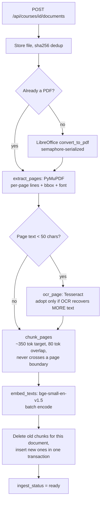
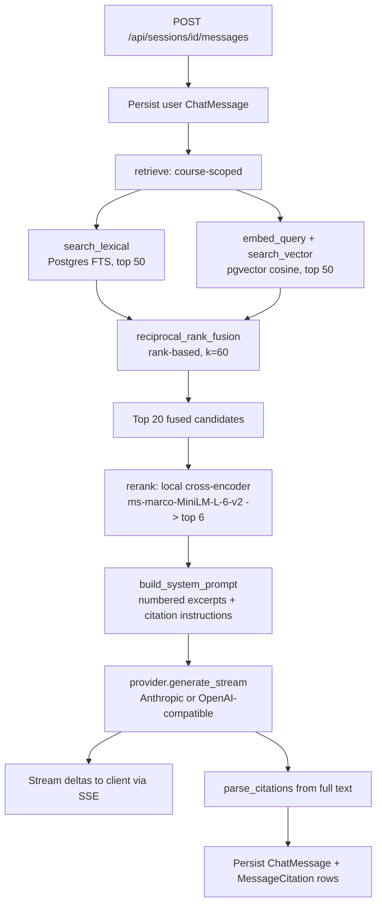

# Architecture

This is Phase 0 of `RETRIEVAL_UPGRADE_PLAN.md` — an audit and baseline of the
system as it exists today, before any of the later phases (query
understanding, semantic memory, evaluation harness, multimodal retrieval)
are added.

## Module map

```
backend/app/
  main.py                  FastAPI app assembly, router registration, /health
  config.py                Settings (env-driven: DB URLs, LLM provider, model names)
  db.py                    SQLAlchemy engine/session setup
  models.py                ORM models: Course, Document, Chunk, ChatSession,
                            ChatMessage, MessageCitation
  schemas.py                Pydantic request/response models

  ingestion/
    convert.py              DOCX/PPTX -> PDF via headless LibreOffice
    parse.py                PDF -> per-page lines with bbox/font metadata (PyMuPDF)
    ocr.py                  Tesseract fallback OCR for a single page
    chunker.py               Page lines -> ~350-token ChunkDrafts with overlap
    embedder.py              sentence-transformers embedding (BAAI/bge-small-en-v1.5)
    pipeline.py               Orchestrates the above end to end per document

  retrieval/
    lexical.py                Postgres full-text search (websearch_to_tsquery)
    vector.py                 pgvector cosine search (HNSW index)
    fusion.py                  Reciprocal Rank Fusion over ranked ID lists
    rerank.py                  Local cross-encoder re-scoring
    service.py                 Orchestrates lexical + vector + fusion + rerank

  generation/
    prompts.py                 System prompt assembly + citation-marker parsing
    chat_service.py             Orchestrates retrieve() -> prompt -> provider stream -> citations

  providers/
    base.py                    LLMProvider protocol (generate / generate_stream)
    anthropic_provider.py, openai_provider.py, factory.py

  routers/
    courses.py, documents.py, chat.py, chunks.py, coverage.py, debug.py

backend/scripts/
  eval_retrieval.py            Offline retrieval-quality (Recall@k/MRR@k) + latency eval, added prior to this plan

backend/bench/
  baseline.py                  Phase 0 corpus-size + per-stage latency baseline (this audit)
  results/baseline.json         Its output

frontend/src/
  api/                        Thin fetch wrappers (courses, documents, chat, chunks)
  components/
    courses/CourseSelector, documents/{DocumentList,UploadDropzone}
    chat/{ChatPane,MessageList,ChatInput,CitationChip}
    source-panel/{SourcePanel,PdfViewer}   # pdfjs-dist, opened by clicking a citation
```

## Data model

```
Course (1) ── (N) Document ── (N) Chunk ── (N) MessageCitation ── (1) ChatMessage
Course (1) ── (N) ChatSession ── (N) ChatMessage
```

- `Document.file_sha256` + `course_id` are unique together — re-uploading the
  same file within a course is a no-op (`documents.py`).
- `Chunk.bboxes` is JSONB: `{page_width, page_height, rects: [{x0,y0,x1,y1}, ...]}`,
  used to render the exact source region in `PdfViewer`.
- `Chunk.tsv` is a Postgres `GENERATED ALWAYS AS ... STORED` column
  (`to_tsvector('english', context_header || text)`), computed by Postgres
  itself, not the application — the lexical index can never drift from the
  chunk text.
- `Chunk.is_ocr` is threaded from `PageLines.is_ocr` through `ChunkDraft`,
  surfaced on `GET /api/courses/{id}/coverage` for OCR provenance.
- `Document.ingest_status` state machine: `pending -> converting (if not PDF)
  -> parsing -> embedding -> ready`, or `failed` at any step, with
  `ingest_error` recorded and the original file retained for retry.

## Request flow: ingestion



Any step raising `ConversionError`/`IngestionError` — or any unexpected
exception — rolls back and sets `ingest_status=failed` with the error message
retained (`pipeline.py:129-136`); it never leaves a document half-ingested.

## Request flow: chat query



`retrieve()` (`retrieval/service.py`) is the single production entrypoint for
this whole path. `routers/debug.py`'s `/api/courses/{id}/search` endpoint
**independently re-implements the same lexical -> vector -> fusion -> rerank
sequence** rather than calling `retrieve()`, so it can also return the
intermediate per-stage rankings for debugging — see "Weaknesses" below for
the drift risk this creates.

## Current state — honest assessment

### Test coverage

- Backend: 60 tests collected (pytest). On a fresh environment (this audit's
  environment), only 29 pass outright, 1 fails, and **29 error before
  running** — see "Critical: broken test-DB fixture" below. Line coverage
  measured from the *partial* run that did execute: **70%** (`app/` total,
  876 statements / 267 missed). This number understates true coverage,
  since 29 of 60 tests — including all of `routers/*`, `retrieval/*`, and
  `ingestion/pipeline.py`'s integration tests — never ran.
- Frontend: 7 test files, 16 tests, **all pass** cleanly (`npx vitest run`).
  One benign `jsdom` warning (`HTMLCanvasElement.getContext` not implemented)
  from `PdfViewer` rendering in a non-browser test environment — not a
  failure, just noise.
- No coverage threshold is enforced in CI/config (`pytest-cov` is a dev
  dependency but no `--cov-fail-under` anywhere).

### Critical: broken test-DB fixture (blocks 29/60 backend tests)

`backend/tests/conftest.py:14-23` creates the `notes_test` database by
issuing a literal `COMMIT` over a SQLAlchemy connection, then running
`CREATE DATABASE notes_test`. Under this stack's driver (`psycopg` v3) and
SQLAlchemy 2.0, that `COMMIT` string does not put the connection into
autocommit mode — the very next statement autobegins a new transaction, and
Postgres refuses `CREATE DATABASE`/`DROP DATABASE` inside any transaction
block. Reproduced directly:

```
sqlalchemy.exc.InternalError: (psycopg.errors.ActiveSqlTransaction)
CREATE DATABASE cannot run inside a transaction block
```

Confirmed via direct probe that `conn.execute(text("COMMIT"))` does **not**
change `dbapi_connection.autocommit`, and that
`conn.execution_options(isolation_level="AUTOCOMMIT")` **does** allow
`CREATE DATABASE` to succeed. On a machine where `notes_test` already exists
(e.g. a prior manual run, or a CI image that pre-seeds it) this fixture never
executes its `CREATE DATABASE` branch and the bug stays hidden — which is
presumably how it shipped unnoticed. This is a fresh-clone/fresh-CI-runner
blocker: `docker compose run --rm backend pytest` fails on **any environment
that has never had `notes_test` created out-of-band**. Not fixed in this
audit (Phase 0 is audit-only, this is a one-line fix — `conftest.py`'s admin
connection needs `.execution_options(isolation_level="AUTOCOMMIT")` — but
that's Phase-1-or-later work, or a standalone fix, per the plan's own
per-phase discipline).

### Dead code

- `backend/app/ingestion/chunker.py:94`: `_make_chunk([], page, header) if
  False else _make_chunk(...)` — a literal `if False else` branch. The `if
  False` arm is unreachable dead code, almost certainly a debugging leftover
  that was never cleaned up.

### Minor test fragility

- `backend/tests/providers/test_providers.py:9` skips
  `test_anthropic_generate_returns_text` only when `LLM_API_KEY` is *unset*,
  not when it's set to a non-Anthropic key. This repo's `.env` is currently
  configured for the OpenAI-compatible provider (`LLM_PROVIDER=openai`,
  pointed at an NVIDIA NIM endpoint), so `LLM_API_KEY` is a valid key *for
  that provider* — the test still runs, calls the real Anthropic API with
  it, and fails with 401. Not an app bug; a test isolation gap (skip
  condition doesn't check which provider the key is actually for).

### Correctness concerns to carry into later phases

1. **No hard cap on chunk token count → silent embedding truncation.**
   `chunk_pages` (`chunker.py:71-88`) only flushes the current chunk when a
   *new* line would push it over `target_tokens=350` — but if a single line
   (one PyMuPDF text span-group) is itself larger than that, or several
   lines accumulate before the next overflow check, nothing stops a chunk
   from exceeding `BAAI/bge-small-en-v1.5`'s `max_seq_length=512` (confirmed
   directly against the loaded model). `sentence-transformers` truncates
   silently past that point — no error, no log. Meanwhile the lexical arm
   (`tsvector`, Postgres full-text) indexes the **entire** chunk text with no
   truncation. Net effect: for an oversized chunk, the vector and lexical
   arms can be searching different amounts of the same content, and nobody
   is told this happened.
2. **RRF constant `k=60`** (`fusion.py:4`) is the standard default from the
   original RRF paper, but it's never been validated against this corpus —
   no ablation exists yet (Phase 3 of the plan covers this).
3. **Chunks never cross a page boundary** (documented, intentional — keeps
   citations exact) but this means a concept split across a page break
   produces two chunks with no shared context beyond whatever the
   carried-forward header supplies. A deliberate precision-over-recall
   tradeoff, worth being able to name in an interview as a tradeoff rather
   than an oversight.
4. **`routers/debug.py` duplicates `retrieval/service.py`'s pipeline**
   instead of calling `retrieve()` and additionally returning per-stage
   ranks. Two independent implementations of lexical→vector→fusion→rerank
   means a future change to one (e.g. the Phase 1/2 work in this plan) can
   silently drift from the other.
5. `main.py` uses the deprecated `@app.on_event("startup")` (FastAPI
   deprecation warning, not yet broken, but worth migrating to a `lifespan`
   handler before it's removed upstream).

No TODO/FIXME/XXX/HACK markers exist anywhere in `backend/app` or
`frontend/src` — the codebase is small and was kept clean of that kind of
marker; the gaps above were found by reading and by running the suite, not
by grepping for known-issue markers.

## Baseline benchmark

See `backend/bench/baseline.py` and `backend/bench/results/baseline.json`
(run from inside the backend container, where they live at `bench/baseline.py`
/ `bench/results/baseline.json` relative to `/app`). Summary in the README's Results table, full detail in `docs/BUILD_LOG.md`.
Note: `corpus.chunks_total` in that JSON is a **global** count across every
course in the DB; `corpus.benchmarked_course_chunks` is the actual working
set the latency numbers below it were measured against, since
`search_lexical`/`search_vector` are course-scoped — don't conflate the two
when quoting a number.

## Phase 1: query understanding and working memory

This module map and the ingestion/query flow diagrams above describe the
system as of Phase 0. Phase 1 adds `app/query/{understanding,compaction}.py`
in front of the query-flow diagram's `retrieve: course-scoped` step (one LLM
call classifies intent and conditionally rewrites the query before
retrieval runs), and swaps `_history_messages` for a compaction-aware
history builder in front of `build_system_prompt`. New tables `query_turns`
and `retrieved_chunks` hang off `ChatMessage` alongside `MessageCitation`;
`chat_sessions` gained `summary`/`summarized_through_message_id`. Design
decisions and the latency cost of the new call are in `docs/adr/001-004-*.md`
and `docs/BUILD_LOG.md`'s Phase 1 section — not re-diagrammed here to avoid this
document drifting from Phase 0's own audited baseline.

## Phase 2: semantic memory

Adds `app/memory/{schemas,extraction,decay,retrieval,session_extraction}.py`
and a new `memories` table (course-scoped, `MessageCitation`-independent —
memories are never citable, see ADR 005). Retrieval happens in
`chat_service.py` alongside chunk retrieval, feeding a separate
`<student_context>` block in `build_system_prompt`'s output rather than the
`<excerpts>` block the query-flow diagram shows. Extraction is not part of
the request-response query flow at all: it's triggered opportunistically
from `routers/chat.py`'s session-create endpoint, capped at one attempt per
call (ADR 008), so it doesn't belong on the diagram above either. Design
decisions in `docs/adr/005-009-*.md`; acceptance-criteria results and the
memory-retrieval latency number are in `docs/BUILD_LOG.md`'s Phase 2 section.

## Phase 3: evaluation harness

Doesn't touch the request/response system at all — it's an offline
measurement layer living entirely under `backend/bench/phase3_*.py` plus a
hand-authored test set at `backend/scripts/eval/phase3_queries.json`.
Reads the same modules the diagrams above describe (`retrieval/service.py`'s
individual stages, `query/understanding.py`, `memory/retrieval.py`,
`generation/prompts.py`) directly, rather than adding new production code
paths. Design rationale in `docs/adr/010-phase3-eval-design.md`; results and
methodology in `backend/bench/results/ablation.md` and `docs/BUILD_LOG.md`'s Phase 3
section.

## Phase 4: multimodal retrieval

Adds `app/ingestion/{figures,image_embedder}.py` (figure extraction via
PyMuPDF + SigLIP embedding) and a new `figures` table (course-scoped,
independent embedding space and index from `chunks` — ADR 012). Ingestion
gains a step after chunk embedding that extracts, embeds, and persists a
document's figures; it can fail without failing the document (ADR 014,
same graceful-degradation shape as OCR). `app/retrieval/figures.py`
mirrors the chunks retrieval module's shape (a dense arm and a lexical
arm, fused with the same `reciprocal_rank_fusion()`) but is invoked
independently in `chat_service.py` — figures are never part of the
system prompt the query-flow diagram's `<excerpts>` block describes, and
never merged into the diagram's retrieval step at all (ADR 013); they
attach to the response as a separate `related_figures` list the frontend
renders alongside, not inside, the assistant's message. Design decisions
in `docs/adr/011-014-*.md`; acceptance-criteria results, the honest
recall number, and what's explicitly not demonstrated (video, trained
representations) are in `docs/BUILD_LOG.md`'s Phase 4 section.
